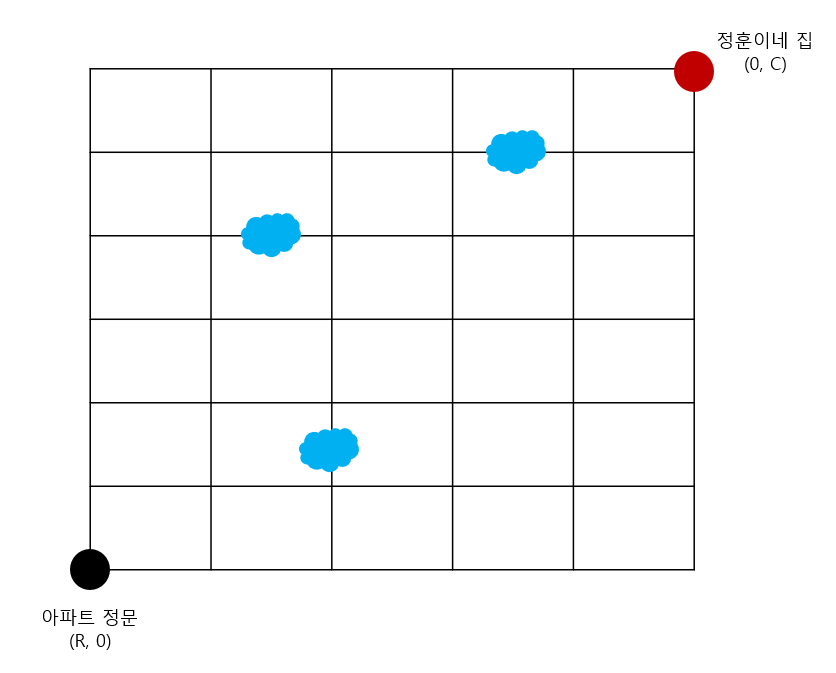

# 물웅덩이 [★★ ~ ★★★★☆]
**원본**: 2021 한국수학올림피아드 고등부 오일러부 1차 19번

* 해당 문제는 원본 문제를 코딩 문제 스타일로 변형하였습니다.
* 원본 문제의 저작권은 [한국수학올림피아드](https://www.kmo.or.kr/kmo/sub07.html)에 있습니다.
* 문제가 잘못되었거나, 해당 솔루션 코드에 대한 반례가 있는 경우 issue 또는 PR로 저격해 주세요 코딩을 잘 하는 편이 아니라서 문제에 실수가 많을 수 있습니다.

## 문제


정훈이네 아파트 단지의 넓이는 세로가 **R**, 가로가 **C** 크기의 직사각형이며 아파트 정문은 그 중 맨 왼쪽 아래에 있고, 정훈이네 집은 맨 오른쪽 위에 있다. 아파트 단지의 아파트들은 1 간격으로 세워져 있으며, 각 아파트 사이에 가로, 세로의 길이 존재한다. 대각선으로 이루어져 있는 길은 존재하지 않는다.

학교 수업이 끝나고 집에 돌아가는 초등학생 정훈이는, 아파트 정문 앞에 도착했다. 그런데, 어제 비가 왔는 지, 몇몇 아파트 사이의 길의 중앙 부분에 N개의 물웅덩이가 생겼다.

정훈이는 길을 걸을 때, 물웅덩이를 밟고 걷는 것을 좋아한다. 하지만 물웅덩이를 너무 많이 밟으면 옷이 젖게 되고, 부모님에게 혼날게 뻔하니, 물웅덩이를 한 번 만 밟으려고 한다. 그리고 빨리 집에가고 싶어하기 때문에, 항상 최단거리로 집에 들어간다. 1칸 이동할 때, 오른쪽 또는 위쪽을 향해서만 이동한다.

정훈이가 아파트 정문에서 집으로 갈 때, **물웅덩이를 딱 한번만 밟고** 집에 도착하는 경우의 수를 구하시오.

## 입력
* 1번 째 줄에 아파트 단지의 세로 R과, 가로 C이 주어진다.
* 2번 째 줄에 물웅덩이의 갯수 N이 주어진다
* 3번 째 줄 부터 3+N 줄 까지 가로 또는 세로로 인접한 아파트의 좌표 y1, x1, y2, x2가 주어진다. 이 아파트 사이에 물웅덩이가 있다. y는 y축 값, x는 x축 값을 의미한다. 같은 물웅덩이의 위치가 두개 이상인 경우는 없다.

## 출력
* 정훈이가 아파트 정문에서 집 까지 물웅덩이를 딱 한번만 밟고 도착하는 경우의 수를 1,000,000,007로 나눈 나머지를 출력한다.

## 조건
* 맨 왼쪽 위의 좌표는 (0, 0)이고, 맨 오른쪽 아래의 좌표는 (R, C) 이다.
* **Easy** 1 <= R, C <= 10
* **Hard** 1 <= R, C <= 100
* 1 <= N <= R * C
* 0 < y1 <= R, 0 <= x1 < C
* 0 <= y2 < R  1 < x2 <= C
* y2 <= y1, x1 <= x2, y1 - y2 = x2 - x1 = 1

## 예제1
### 입력
```
6 5
3
5 2 4 2
2 1 2 2
1 3 1 4
```
### 출력
```
179
```
실제 올림피아드 문제 입니다.

## 예제2
### 입력
```
3 3
12
0 0 0 1
0 2 0 3
1 1 0 1
1 2 0 2
1 3 0 3
1 1 1 2
1 2 1 3
2 0 2 1
2 1 2 2
3 1 2 1
3 2 2 2
3 3 2 3
```
### 출력
```
0
```
집까지 가는 경로에 물웅덩이가 최소 2개 이상 있으므로 어느 경로로 가든 간에 부모님에게 혼납니다.

## 현재 솔루션 코드 성능 측정 결과 (파이썬 기준)

_**Note**_: 모듈러 처리가 아직 제대로 되어 있지 않아서 데이터가 큰 경우 속도가 많이 느림

|Case Num/Code|아파트 단지 크기|웅덩이 갯수|Easy Solution|Hard Solution|
|---|---|---|---|---|
|#1|6x5|3|2 ms/ 15 MB|0 ms / 16 MB|
|#2|3x3|12|0 ms/ 15 MB|0 ms / 16 MB|
|#3|10x10|2|605 ms/ 15 MB|0 ms / 16 MB|
|#4|10x10|4|540 ms/ 15 MB|0 ms / 16 MB|
|#5|10x10|7|515 ms/ 15 MB|0 ms / 16 MB|
|#6|30x30|97|측정 불가|6 ms / 16 MB|
|#7|50x50|896|측정 불가|642 ms / 26 MB|
|#8|100x100|2219|측정 불가|5714 ms / 78 MB|
|#9|100x100|6572|측정 불가|103108 ms / 540 MB|

## 힌트
<details>
<summary>힌트 1</summary>
<ul>
    <li>선수지식: 중복집합 순열, 위상정렬</li>
</ul>
</details>

<details>
<summary>힌트 2</summary>
<ul>
    <li>출발지 -> 물웅덩이 -> 집. 이 하나의 경로를 둘로 쪼개보자</li>
</ul>
</details>

<br >

## 태그
<details>
<summary>Easy</summary>
<ul>
    <li>그래프 이론</li>
    <li>깊이 우선 탐색</li>
    <li>인접 그래프</li>
    <li>백트래킹</li>
</ul>
</details>

<details>
<summary>Hard</summary>
<ul>
    <li>그래프 이론</li>
    <li>정렬</li>
    <li>위상 정렬</li>
    <li>집합론</li>
    <li>조합론</li>
    <li>기하학</li>
    <li>다이나믹 프로그래밍</li>
</ul>
</details>